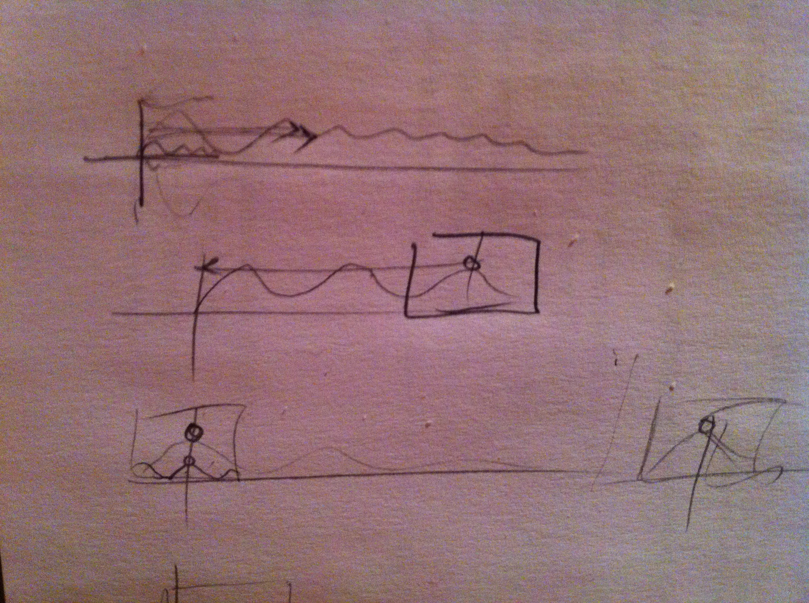
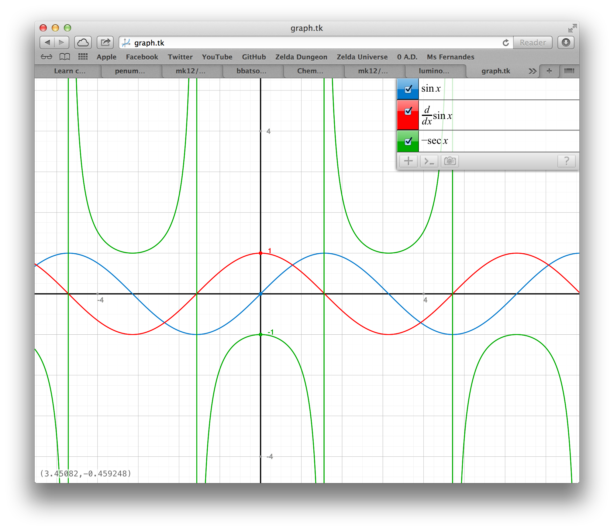
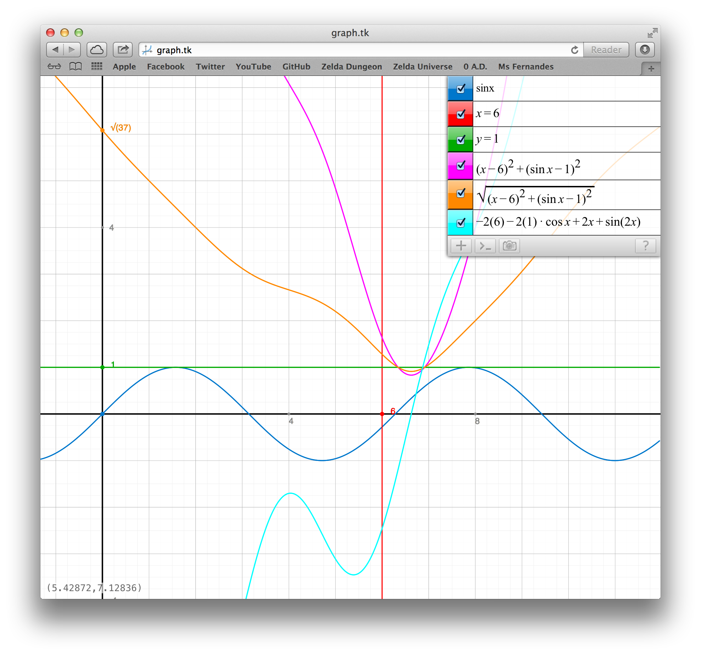
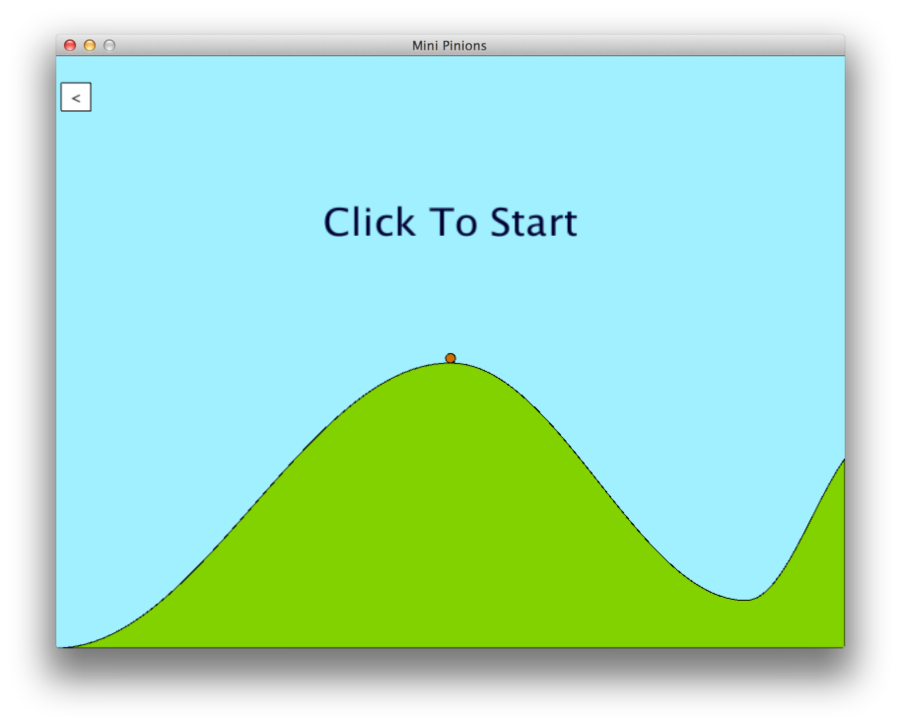

# Development Notes

## Learning Clojure

**[16 Oct. 2013]**
I already know a bit about Lisp having read _The Little Schemer_, but Clojure is different. I read [A Brief Beginner's Guide to Clojure][1] to get started with it. I am using [Leiningen][2] to manage the project, which seems to be pretty standard in the Clojure community. To access everything that Processing offers, I am using [Quil][3]. (Its README is interesting and a bit strange, mostly because half of it is poetry. There is also a reference to [_why][4] in it.)

[1]: http://www.unexpected-vortices.com/clojure/brief-beginners-guide/index.html
[2]: https://github.com/technomancy/leiningen
[3]: https://github.com/quil/quil
[4]: http://en.wikipedia.org/wiki/Why_the_lucky_stiff

Here are a couple cheat sheets that may be useful later on:

- [Clojure](http://clojure.org/cheatsheet)
- [Quil](https://github.com/quil/quil/raw/master/docs/cheatsheet/cheat-sheet.pdf)

## Functional programming

**[17 Oct. 2013]**
I read through this [article][5] to learn more about the functional programming way of handling state. It is very insightful. I will try to use functional programming as much as possible, but for some things this just won't work: the current GUI screen, the current state of the simulation. I will need to use "identities" for these.

**[18 Oct. 2013]**
I watched this [video lecture][6] to learn more about the philosophy behind Clojure and functional programming in general. I was linked to it from this Stack Overflow [question][7]. The lecturer, Rich Hickey, is actually the author of Clojure. If you don't know anything about functional programming, I would highly recommend watching the lecture. It goes into much more depth than the article I mentioned above. I know I am spending a lot of time on this kind of thing, but I think it is worth learning. 

Languages with manual memory management have significant _incidental complexity_. Garbage-collected OOP languages such as Java are better, but they still have incidental complexity of another kind: time management. The building block with the least incidental complexity is a pure function: all it does is convert input to output; time is irrelevant. Mutable objects pretend to have a notion of time, but it isn't concrete. The problem is inherent in the philosophy of OOP, and it becomes much more apparent when you try to write multithreaded programs. Objects are useful for modelling the world around us, but _changing_ objects are just a construct of our minds. A falling ball is _not_ a ball that changes. It is a sequence of immutable ball values that are related. Each future version of the ball is function of the past version. Some definitions (taken from one of the slides):

- **value**: an immutable magnitude, quantity, number ... or immutable composite thereof
- **identity**: a putative entity we associate with a series of causally related values (states) over time
- **state**: the value of an identity at a moment in time
- **time**: relative before/after ordering of causal values

[5]: http://clojure.org/state
[6]: http://www.infoq.com/presentations/Are-We-There-Yet-Rich-Hickey
[7]: http://stackoverflow.com/questions/9132346/clojure-differences-between-ref-var-agent-atom-with-examples

## Modelling the user interface

**[19 Oct. 2013]**
I was having a hard time getting started with this, so I asked [a question][8] on Stack Overflow. One person answered, and they linked me to this [blog post][9], which proved to be pretty useful. I am going to try to model everything as simply and elegantly as possible and worry about performance later (if I need to). I think that once I get past this hurdle of modelling state (the UI state and the game simulation state), things will go much quicker.

I found _another_ [video lecture][10] by Rich Hickey. He goes into more detail about persistent data structures and the specific time management constructs found in Clojure.

Huzzah! I have finally got a system working where the state of the UI and of the game world is properly managed. I can easily switch between UI screens, and the game simulation can be advanced by making the next state a function of the previous state. I was a bit dismayed when I noticed that the frame rate was struggling between 30 and 40 FPS, but I tried changing the rendered to OpenGL and it immediately jumped to 60 FPS, indicating that the bottleneck was the renderer, not any inherent slowness in Clojure.

[8]: http://stackoverflow.com/questions/19461857/modelling-game-ui-screens-in-clojure
[9]: http://stevelosh.com/blog/2012/07/caves-of-clojure-02/
[10]: http://www.infoq.com/presentations/Value-Identity-State-Rich-Hickey

## Taking flight

**[20 Oct. 2013]**
The main menu now has some nifty buttons. But it's time to focus on the main game. I don't know when the halfway checkpoint deadline is, but it probably isn't too far away. A thought occurred to me as I imagined the hills and valleys of Fledge's world (the bird is officially called Fledge, by the way): it looks an awful lot like a sinusoidal curve. Forget Bézier and other similarly complicated stuff – I will just use trig functions to create the landscape!

I found [a blog dedicated to Tiny Wings physics][11] – imagine that! After actually reading it, though, I realized that it isn't very useful to me.

**[21 Oct. 2013]**
It may not be especially fast, but I am making progress. I love Clojure, but functional programming tends to twist your brain into a pretzel when you are (like me) fairly new to it. That isn't to say that I am much less productive with it than I would be with Java or some other OOP language at the moment – the stuff I am modelling right now (the curves that define a level) really does take quite a bit of thinking. I think I have implemented it in the best way possible. The _divide and conquer_ method is really helping me.

[11]: http://tinywingsphysics.blogspot.ca

## Still taking flight

**[22 October 2013]**
The halfway checkpoint deadline, 24 October 2013, is looming on the horizon like a big thing that looms, so I am trying to get things done quickly. I now have a nice set of button functions that make it super easy to use buttons in the mani menu, and I will also use them in other Worlds. But now I am entirely focused on the Game world – I need to get Fledge moving!

It is 1:15 a.m., and Fledge is moving! He is racing along horizontally, allowing the sine landforms to be traced in all their glory. All that is left for the halfway checkpoint is the physics.

## A sinusoidal interlude

**[23 October 2013]**
The game is coming along well. I experimented with _memoization_, which uses a cache to avoid calling a function on the same arguments to improve performance at the expense of memory usage. Without that, I am calculating the same y-values for the same cosine graphs many, many times. However, when I tried using the technique (which is so easy in clojure: given a function `fn`, you just use `(memoize fn)` and it does it all for you!), it actually didn't make it go any faster even though the memoization was working (I checked), leading me to believe that drawing is still the bottleneck. The OpenGL renderer can draw much faster, but it doesn't work on the school computers. I will just have to make do with low-resolution curves.

I was having some trouble getting the landscape to extend all the way to the edges of the window, but the problem disappeared when I used regular line vertices instead of curve vertices. I spent way too long puzzling over this! I am so stupid for not reading the Processing documentation sooner:

> The first and last points in a series of `curveVertex()` lines will be used to guide the beginning and end of a the curve. A minimum of four points is required to draw a tiny curve between the second and third points.

I spent the next while getting the transformations to work. It took a bit of trial and error, and I eventually discovered that Processing transformations are applied in reverse order, just like in OpenGL (it is because it uses column-major matrices, apparently). Here you can see the some of the critical research that went into the development of the transformations. I will let the drawing speak for itself:

All that is left for the halfway point is the physics (have I said this before?). I went on <http://graph.tk> to do a bit of experimenting: at a given point on my sine curve, what is the normal? It is perpendicular (negative reciprocal) to the tangent, which is given by the derivative. I entered that in, and a vertically reflected secant graph shows up. Interesting. The derivative of the sine function is the cosine function, its reciprocal is secant, and the negative reflects it.

This talk of normals and reflected velocity vectors is all well and good, but what point on the sine graph do I use for this? I tried the one directly underneath Fledge, but this ends up looking strange – I may have to leave it like this and make Fledge very tiny so that it doesn't look so bad, for now. But the real solution is finding the closest point on the sine graph to Fledge. Below, the red and green lines intersect at the point where Fledge is. The orange curve is the distance between Fledge and the sine graph, and the pink curve is its square. Both have the same minimum, which is where the cyan curve (the derivative of the pink one) crosses the x-axis. I don't know how to solve that last one, so I will have to use a numerical approach. I am amazed at how useful everything I've recently learned in Advanced Functions has been so far in this project.

I will deal with this later! For now, I want my halfway checkpoint to be somewhat playable. I have written code to calculate the reflected velocity on a collision with the path (I took it from [Luminosity][12], where I was using the algorithm to reflect rays off mirror surfaces). Now I am modifying it so that if the dot product of velocity and the normal is sufficiently small (close to being parallel), Fledge will slide along instead of bouncing.

It is 1:28 a.m. and I just experienced a moment in which I wanted to smash my head against the wall. No wonder everything seemed so strange! I was simply evaluating the cosine of Fledge's position, when obviously I need to evaluate it based on the actual path and its transformations. I noticed this when I tried drawing a line which represented the normal. I can't believe I didn't realize this sooner.

Finally! It actually feels like _Tiny Wi_---I mean, like I intended it to feel. I still need to fine-tune some constants, but it is already fun and challenging. Some of the code is a bit of a mess, so I will need to go over it carefully and refactor some things.

[12]: https://github.com/mk12/luminosity

## Halftime refactoring

**[24 Oct. 2013]**
The game was running pretty slow on the school computers. I optimized the vectors slightly in case that was the trouble, but it wasn't. The bottleneck seems to always be graphics. I didn't want to have unacceptable low-resolution curves, so I tried drawing straight lines instead of spline curves to join the sine points, and performance went way up.

The physics is basically done, other than the fact that I need to rewrite it in smaller functions because it is pretty messy right now.

**[25 Oct. 2013]**
I went through most of the code and improved little things to make it more readable and consistent. I spent a lot of time refactoring the game world's update function, splitting it into four smaller functions. I also removed some magic numbers (turned them into named constants). I added colour (blue sky and green hills), and I was surprised by how much better it looked that way. I also made a lot of other little modifications, like dividing resolution by the scale so that the number of vertices drawn per frame is constant (it doesn't draw more when you zoom out now). I made it so that you have to click to start the game (a message tells you to), and there is now a back button to return to the menu.

I removed the frame rate from the main menu (I was showing it in the top-left corner before), and for some reason that made all the text start to look good. Before the text all looked horrible. I've encountered what seems to be an OpenGL bug with Quil that is occurring after I updated to OS X Mavericks: there is a gap of about twenty pixels from the top of the window to the top of where it rendered. You can see it in the screenshot above because the button should be five pixels from the top and the left edges. The Processing 3D renderer doesn't  do this, but it looks worse and is slower. I may end up using something other than Quil in the future if it isn't too much of a hassle – it would take little change since most of my functions are pure anyway, and I have built on top of abstractions.

I am now ready to continue on with the second half of the steps that I laid out in my proposal. They should go much quicker than the first half did.

**[26 Oct. 2013]**
Today I worked on improving the overall quality of the code and implemented little thing like circular buttons. I also hooked up a lot more of the UI. My goal for tomorrow is to add the planetary gravity part of the game. Once that is in place, I will tag version 0.3.

## Astropinions

**[27 Oct. 2013]**
The OpenGL problem I mentioned earlier has suddenly gone away, which is good because it was getting annoying. I did some more work on cleaning up the code today. In particular, I really rethought the way the buttons should work, and I've improved the way their actions are dispatched. I've added buttons for pausing and restarting the game, and now when you return to the menu and then go back to the game, your previous game is still there, ready to be resumed.

I spent a lot of time working on implementing the planetary gravity part of the game. I got the scree to smoothly transition between the two modes. When you go really high, the background becomes darker and the camera zooms back in and centres on Fledge. I am very pleased with the result. Now I just need to add the planets.